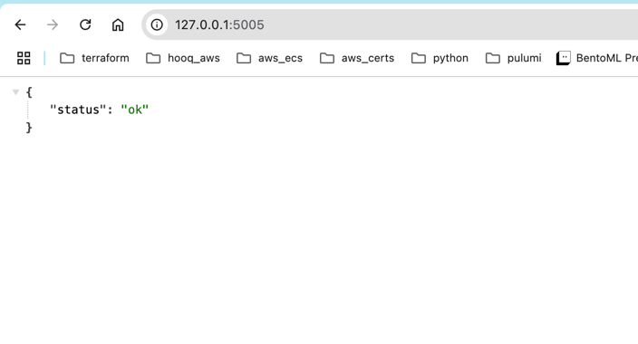

# flyway-poc
flyway-poc

### Run `flyway migrate`
```shell
bharathkumardasaraju@sampleapp$ flyway migrate
Flyway OSS Edition 11.7.2 by Redgate

See release notes here: https://rd.gt/416ObMi
Database: jdbc:mysql://localhost:3306/ (MySQL 8.0)
Creating schema `sampleapp` ...
Creating Schema History table `sampleapp`.`flyway_schema_history` ...
Current version of schema `sampleapp`: null
Migrating schema `sampleapp` to version "0 - create database"
WARNING: DB: Can't create database 'sampleapp'; database exists (SQL State:  - Error Code: 1007)
Migrating schema `sampleapp` to version "1 - init schema"
Migrating schema `sampleapp` to version "2 - add table"
Successfully applied 3 migrations to schema `sampleapp`, now at version v2 (execution time 00:00.018s)
bharathkumardasaraju@sampleapp$ 
```
```sql
bharathkumardasaraju@abaxx-charts$ mysql -u root -p
Enter password:
Welcome to the MySQL monitor.  Commands end with ; or \g.
Your MySQL connection id is 28
Server version: 8.0.34 MySQL Community Server - GPL

Copyright (c) 2000, 2025, Oracle and/or its affiliates.

Oracle is a registered trademark of Oracle Corporation and/or its
affiliates. Other names may be trademarks of their respective
owners.

Type 'help;' or '\h' for help. Type '\c' to clear the current input statement.

mysql> show databases;
+--------------------+
| Database           |
+--------------------+
| information_schema |
| mysql              |
| performance_schema |
| sampleapp          |
| sys                |
+--------------------+
5 rows in set (0.00 sec)

mysql> use sampleapp;
Reading table information for completion of table and column names
You can turn off this feature to get a quicker startup with -A

Database changed
mysql> show tables;
+-----------------------+
| Tables_in_sampleapp   |
+-----------------------+
| flyway_schema_history |
| orders                |
| users                 |
+-----------------------+
3 rows in set (0.01 sec)

mysql> select * from users;
Empty set (0.00 sec)

mysql> select * from orders;
Empty set (0.00 sec)

mysql> select * from flyway_schema_history;
+----------------+---------+------------------------------+--------+-------------------------+------------+--------------+---------------------+----------------+---------+
| installed_rank | version | description                  | type   | script                  | checksum   | installed_by | installed_on        | execution_time | success |
+----------------+---------+------------------------------+--------+-------------------------+------------+--------------+---------------------+----------------+---------+
|              0 | NULL    | << Flyway Schema Creation >> | SCHEMA | `sampleapp`             |       NULL | root         | 2025-04-21 16:32:24 |              0 |       1 |
|              1 | 0       | create database              | SQL    | V0__create_database.sql | -688311850 | root         | 2025-04-21 16:32:24 |              5 |       1 |
|              2 | 1       | init schema                  | SQL    | V1__init_schema.sql     | 1185115351 | root         | 2025-04-21 16:32:24 |              6 |       1 |
|              3 | 2       | add table                    | SQL    | V2__add_table.sql       | 1101982707 | root         | 2025-04-21 16:32:24 |              7 |       1 |
+----------------+---------+------------------------------+--------+-------------------------+------------+--------------+---------------------+----------------+---------+
4 rows in set (0.00 sec)

mysql>
```

### Run the flask app locally
```shell
bharathkumardasaraju@sampleapp$ /usr/local/bin/python3.12 -m src.app
 * Serving Flask app 'app'
 * Debug mode: off
WARNING: This is a development server. Do not use it in a production deployment. Use a production WSGI server instead.
 * Running on all addresses (0.0.0.0)
 * Running on http://127.0.0.1:5005
 * Running on http://10.210.10.67:5005
Press CTRL+C to quit
127.0.0.1 - - [21/Apr/2025 16:36:49] "GET / HTTP/1.1" 200 -
127.0.0.1 - - [21/Apr/2025 16:36:55] "GET /health HTTP/1.1" 200 -


```

### flask API
